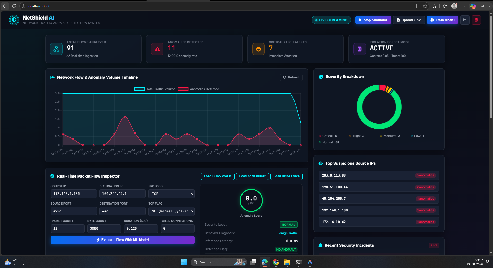
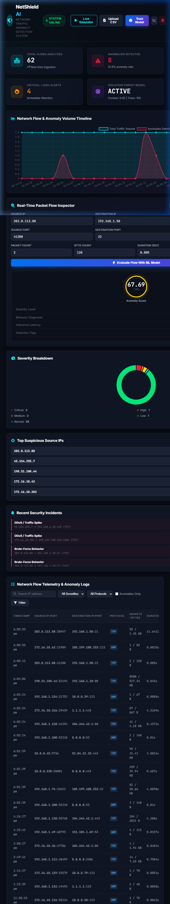
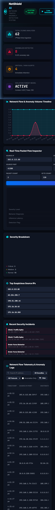

# NetShield AI — Network Traffic Anomaly Detection

An end-to-end Machine Learning web application that detects unusual network traffic behavior (such as DDoS spikes, port scanning, brute-force behavior, unusual packet volume, and suspicious IP activity) using **Isolation Forest**, **FastAPI**, **SQLite**, **MLflow**, and **Prometheus**.

---

## 📸 Application Preview & Dashboard Showcase

### 🖥️ Real-Time Cyber SOC Command Center


### 📱 Responsive Layouts (Tablet & Mobile)
| Tablet View | Mobile View |
| :---: | :---: |
|  |  |

---

## 🏢 Business Problem

Organizations generate massive volumes of network traffic every single day across corporate networks, cloud environments, and internal infrastructure. Relying solely on manual inspection or traditional static signature-based firewalls causes major security and operational bottlenecks:

- **Delayed Detection of Emerging Threats**: Static rule-based systems struggle to catch novel, zero-day, polymorphic, or low-and-slow attack behaviors.
- **Alert Fatigue & Noise**: Security Operations Center (SOC) and DevOps teams are overwhelmed with thousands of unranked logs without severity quantification, causing critical alerts to be missed.
- **Critical Attack Vectors to Detect**:
  - **DDoS Spikes & SYN Floods**: Sudden massive packet spikes exhausting server bandwidth.
  - **Port Scanning & Network Probes**: Reconnaissance scanning to identify open, vulnerable service ports.
  - **Brute-Force Behavior**: Repeated automated credential attempts targeting SSH, RDP, or FTP.
  - **Data Exfiltration**: Stealthy high-volume outbound data transfers to unauthorized external IPs.
  - **Misconfigured Systems & Compromised Internal Endpoints**: Internal hosts behaving abnormally.

> **Important**: The objective is to build a reliable **early-warning system** that detects behavioral anomalies and prioritizes investigation, rather than making unverified automated claims.

---

## 💡 The Solution: NetShield AI

**NetShield AI** addresses this challenge with an end-to-end Machine Learning anomaly detection system:

1. **Unsupervised Outlier Detection**: Utilizes Scikit-learn's **Isolation Forest** to model baseline benign traffic patterns and isolate abnormal network deviations without requiring pre-labeled attack datasets.
2. **Feature Engineering Pipeline**: Extracts domain-specific network flow metrics including packet rates (`packets_per_sec`), byte throughput (`bytes_per_sec`), payload density (`bytes_per_packet`), privileged destination ports, and categorical protocol/flag encodings.
3. **Continuous Anomaly Scoring ($0 - 100$)**: Normalizes multidimensional tree isolation paths into an intuitive, calibrated $0-100$ score.
4. **5-Tier Severity Ranking**: Stratifies alerts into `Normal`, `Low`, `Medium`, `High`, and `Critical` to eliminate alert fatigue and help SOC teams prioritize response.
5. **Heuristic Behavioral Diagnostics**: Explains anomaly triggers (e.g., classifying high packet frequency as *DDoS*, repeated failed handshakes as *Port Scan*, multiple authentication failures as *Brute-Force*).
6. **Real-Time SOC Command Center**: Interactive dark-themed web dashboard with live traffic streaming, single-flow packet inspection, batch CSV upload analysis, and time-series visualization.
7. **ML Ops & Production Observability**: Tracks model training runs and hyperparameters using **MLflow**, and exports real-time latency and flow metrics to **Prometheus**.

---

## 🌟 Key Features

1. **Machine Learning Pipeline**:
   - **Algorithm**: Scikit-learn `IsolationForest` unsupervised outlier detection.
   - **Feature Engineering**: Derives packet rates, byte rates, packet sizes, port privilege flags, and protocol/TCP flag categorical encodings.
   - **Continuous Scoring**: Normalizes raw decision functions into an intuitive `0 - 100` Anomaly Score.
   - **Multi-Level Severity**: Classifies flows into `Normal`, `Low`, `Medium`, `High`, and `Critical`.
   - **Heuristic Diagnostic Engine**: Automatically tags suspicious activity (e.g., *DDoS / Traffic Spike*, *Port Scanning*, *Brute-Force Behavior*, *Data Exfiltration*, *ICMP Flood*).

2. **Backend & Persistence**:
   - Built with **FastAPI** and **Uvicorn**.
   - **SQLite + SQLAlchemy ORM** for persistent flow telemetry, anomaly history, and model training run logs.
   - RESTful endpoints for single prediction, batch CSV uploads, real-time simulation, and training.

3. **Experiment Tracking & Monitoring**:
   - **MLflow Tracking**: Logs hyperparameters (`n_estimators`, `contamination`), evaluation metrics, and serialized model artifacts.
   - **Prometheus Metrics**: Exposes custom application and model telemetry at `/metrics` (flow counters, anomaly counters by severity/type, active model contamination, and inference latency).

4. **Interactive Cybersecurity SOC Dashboard**:
   - Dark theme command center with glassmorphic cards and glowing neon accents.
   - **Real-Time Traffic Simulator**: Streams live simulated benign and malicious flows.
   - **Interactive Packet Inspector**: Custom packet flow evaluator with instant circular score gauge and diagnostic breakdown.
   - **Filterable Telemetry Table**: Real-time filtering by IP, protocol, severity, and anomaly-only status with pagination.
   - **Batch CSV Upload**: Drag-and-drop file upload with live progress and result summary.
   - **Model Retraining Modal**: Adjustable hyperparameter sliders with MLflow run history inspection.

---

## 📁 Project Structure

```text
network-traffic-anomaly-detection/
│
├── backend/
│   ├── main.py            # FastAPI endpoints, Prometheus metrics, and static mounting
│   ├── ml.py              # Feature engineering, Isolation Forest model, MLflow tracker
│   └── database.py        # SQLite models, sessions, and CRUD operations
│
├── frontend/
│   ├── index.html         # Cyber SOC Command Center dashboard
│   ├── style.css          # Glassmorphic dark styling & responsive design
│   └── script.js          # Chart.js graphs, live simulator, and API integration
│
├── data/
│   ├── network_traffic.csv # Baseline benchmark traffic dataset (~3,000 records)
│   └── network_traffic.db  # SQLite database (auto-generated)
│
├── models/
│   ├── isolation_forest.pkl # Serialized Isolation Forest model
│   └── preprocessor.pkl     # Serialized feature transformers & calibration data
│
├── requirements.txt       # Python dependencies
├── Dockerfile             # Container definition
└── README.md              # Documentation
```

---

## 🚀 Getting Started Locally

### 1. Prerequisites
- Python 3.10+ (Python 3.11/3.13 recommended)
- `pip`

### 2. Installation
Clone or navigate to the project directory and install dependencies:

```bash
pip install -r requirements.txt
```

### 3. Start the Application Server
Run the FastAPI application with Uvicorn:

```bash
python -m uvicorn backend.main:app --host 127.0.0.1 --port 8000 --reload
```

### 4. Access Dashboard & Endpoints
- **Web Dashboard**: [http://localhost:8000](http://localhost:8000)
- **Interactive Swagger Docs**: [http://localhost:8000/docs](http://localhost:8000/docs)
- **Prometheus Metrics**: [http://localhost:8000/metrics](http://localhost:8000/metrics)
- **MLflow Tracking UI** (Optional): Run `mlflow ui` to browse runs.

---

## 🐳 Running with Docker & Docker Compose

### Option A: Run with Docker Compose (Recommended)
Starts both the **NetShield AI Application** and the **Prometheus Monitoring Server** with persistent storage volumes:

```bash
# Build and start services in background
docker compose up -d --build

# View logs
docker compose logs -f
```

- **NetShield Web Dashboard**: [http://localhost:8000](http://localhost:8000)
- **FastAPI Swagger API**: [http://localhost:8000/docs](http://localhost:8000/docs)
- **FastAPI Prometheus Metrics**: [http://localhost:8000/metrics](http://localhost:8000/metrics)
- **Prometheus UI & Targets**: [http://localhost:9090](http://localhost:9090)

To stop the containers:
```bash
docker compose down
```

---

### Option B: Standalone Docker Image

```bash
# 1. Build image
docker build -t netshield-ai .

# 2. Run container
docker run -d -p 8000:8000 -v $(pwd)/data:/app/data --name netshield-app netshield-ai
```
Visit [http://localhost:8000](http://localhost:8000) in your browser.

---

## 📡 API Reference

| Method | Endpoint | Description |
|---|---|---|
| `GET` | `/api/health` | System health check & active model status |
| `GET` | `/api/stats` | Summary KPI metrics & severity distribution |
| `GET` | `/api/timeline` | Time-series traffic volume and anomaly trends |
| `GET` | `/api/logs` | Paginated and filtered network traffic logs |
| `POST` | `/api/predict/single` | Real-time prediction for a single packet flow |
| `POST` | `/api/predict/batch` | Batch CSV upload and dataset ingestion |
| `POST` | `/api/train` | Retrain model with custom parameters & MLflow logging |
| `GET` | `/api/mlflow/runs` | Retrieve history of model training runs |
| `POST` | `/api/simulate/traffic`| Generate synthetic live traffic streams |
| `DELETE`| `/api/data/clear` | Reset all traffic records in SQLite |
| `GET` | `/metrics` | Prometheus metrics endpoint |

---

## 📊 Anomaly Classification Logic

1. **Anomaly Score Range**: $0.0 - 100.0$ (Higher score $\rightarrow$ Higher abnormality).
2. **Severity Levels**:
   - **Normal**: Score $< 40.0$
   - **Low**: $40.0 \le$ Score $< 55.0$
   - **Medium**: $55.0 \le$ Score $< 70.0$
   - **High**: $70.0 \le$ Score $< 85.0$
   - **Critical**: Score $\ge 85.0$
3. **Behavioral Diagnostics**:
   - **DDoS / Traffic Spike**: Packets/sec $> 500$ or total packet count $> 1,000$.
   - **Port Scanning**: Flag in `["S0", "REJ"]` or fast probes with $\le 3$ packets.
   - **Brute-Force Behavior**: Repeated failed connections ($\ge 3$) on sensitive ports ($22, 21, 3389$).
   - **Data Exfiltration**: Abnormal outbound payload ($> 500 \text{ KB}$).
